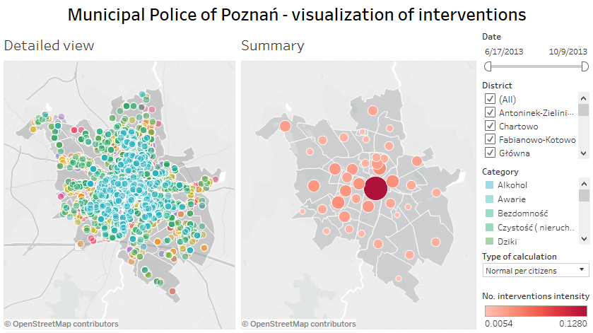
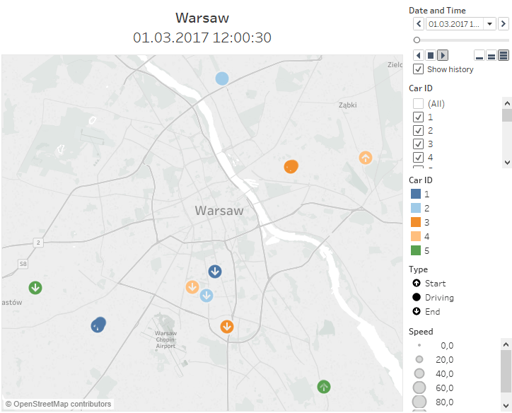

# Tableau projects

In this repository I present some of my work made in Tableau. Workbooks are available in Release section as well as on [my Tableau Public profile](https://public.tableau.com/profile/andrzej.w.jtowicz#).

## Municipal Police of Poznań - map of interventions

This project aims to visualize on a map the interventions made by Municipal Police of Poznań. Statistics are presented between 2013-06-17 and 2013-10-09. Shapes of districts are stored as a data source. The project repository is hosted on [GitHub](https://github.com/andre-wojtowicz/poznan-mp-interventions).

[Tableau Public dashboard](https://public.tableau.com/profile/andrzej.w.jtowicz#!/vizhome/PoznaMPinterventions/Dashboard)

## GPS tracking in Warsaw

This project shows Tableau capability to display GPS tracking. Source of data: [IEEE International Conference on Data Mining](http://tunedit.org/repo/ICDM/2010/gps/gps_training.zip).

[Tableau Public dashboard](https://public.tableau.com/profile/andrzej.w.jtowicz#!/vizhome/gps-cars-30/GPScartrackinginWarsaw)

## Administrative division of Poland with zip codes for Tableau

This project shows how Tableau geocoding can be extended for Poland by adding Poczta Polska zip codes (kody pocztowe) along with voivodeships (województwa), counties (powiaty) and communes (gminy) - this is particularly useful if a hierarchy is created. A lookup table can also be made to transform Poczta Polska zip codes to those recognized by Tableau. The project consists of R and shell scripts. The final custom geocoding is stored in *Local Data* directory and can be easily attached to workbooks and/or published on Tableau Server.

* [CODGiK](http://www.codgik.gov.pl/index.php/darmowe-dane/prg.html) state registry of borders: 2017-01-27
* [Poczta Polska](http://kody.poczta-polska.pl/) zip codes: 2017-05-01
* [Tableau](https://www.tableau.com/) zip codes: 10.2

### Screenshots

Below are screenshots from Tableau for generated custom geocoding.

#### Zip codes (kody pocztowe)

")

#### Communes (gminy)

")

#### Counties (powiaty)

")

#### Voivodeships (województwa)

")
